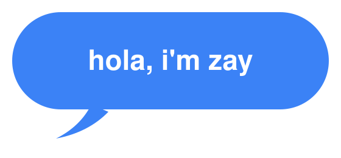
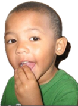

<table>
  <tr>
    <td width="58%" valign="middle">
      
    </td>
    <td width="42%" align="center" valign="bottom">
      >
    </td>
  </tr>
</table>

### 🎀 about me
- 🌵 [where you're based / who you are]
- 💻 [what you study or build — e.g. CS @ UGA]
- 📷 [what you post about / focus area]

### 📁 fav repos
| name | description |
|---|---|
| [`dog-behavior-vision-model`](https://github.com/isaiahcampusano/dog-behavior-vision-model) | dog behavior from video — v1 single image → v4 tail & body-posture cues |
| [`chasemobile`](https://github.com/isaiahcampusano/chasemobile) | [add a one-line description] |

### 🥹 kudos
this code is free to fork, remix, or build on. a shoutout if it helps you ship something is always appreciated, but never required.

- 💼 linkedin: [`isaiah-campusano`](https://linkedin.com/in/isaiah-campusano-802535266)
- 🔗 [add another platform if you've got one]
